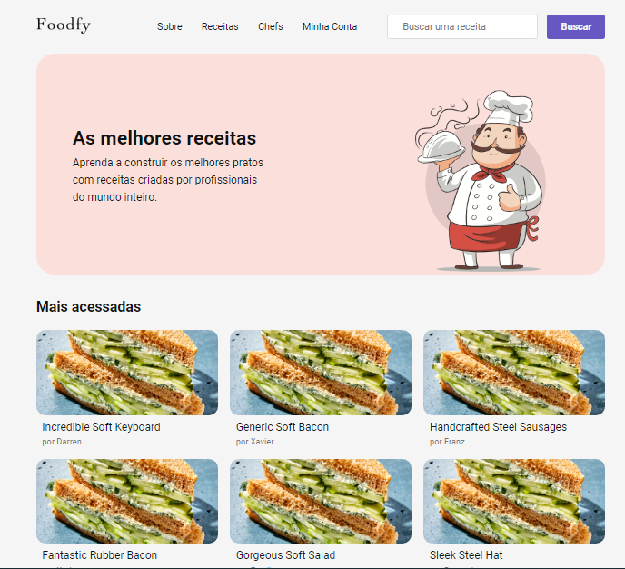
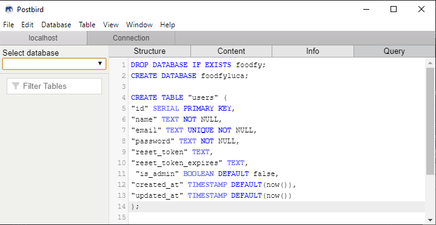
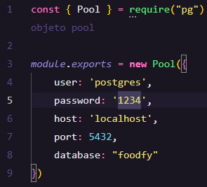

# FoodFy

## 📰 Sobre

<p>Foody é um site com receitas de grandes Chefs da culinária mundial, cadastradas pelos leitores da plataforma.</p>

<p align="center">
  
</p>


### Construido com as seguintes ferramentas:

- Html
- Css
- Javascript
- NodeJS
- PostgreSQL

### Pré-requisitos

- [Node](https://nodejs.org/en/)
- [PostgreSQL](https://www.postgresql.org/)
- [Postbird](https://www.electronjs.org/apps/postbird)
- Conta no [Mailtrap](https://mailtrap.io/) 

## 🔨 Instalação 

1° - Clone o repositório

```
git clone https://github.com/gideonalves/Foodfy.git
```


2° - Instale as dependências

```
npm install
```


3° - No arquivo foodfydb.sql, copie o processo de criação do banco de dados e rode na query do Postbird.

<p align="center">
  
</p>


4° - Configure o arquivo src/config/db.js com o usuário e senha usados na instalação do Postbird.

<p align="center">
  
</p>


5° - Popule o banco de dados utilizando o comando:

```
node seeds.js
```

**Obs:** Para acessar a área administrativa, utilize um dos emails da tabela **users** no Postbird. A senha padrão para os usuários criados pelo seeds é **1111**.


6° - Inicie o projeto

```
npm start
```


Ao criar novos usuários, um e-mail será enviado para a aplicação **Mailtrap**. Acesse o arquivo src/lib/mailer.js e utilize as configurações informadas na sua conta do Mailtrap para que os emails sejam enviados corretamente. 


## 🔍 Notes

<p>O projeto <strong>Foodfy</strong> foi desenvolvido durante o Bootcamp Launchbase da <a href="https://rocketseat.com.br" alt="Rocketseat" target="_blank">Rocketseat</a>, ministrado pelo professor <a href="https://github.com/maykbrito" alt="Mayk Brito" target="_blank">Mayk Brito</a>.</p>


<p align="center">
  
</p>
